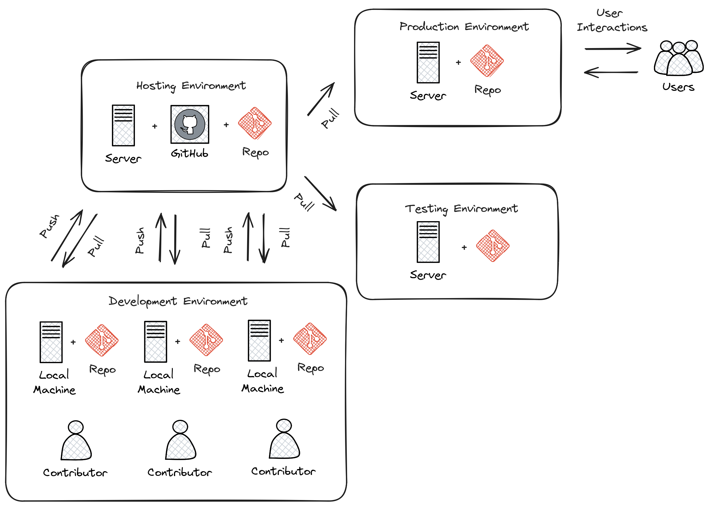

# Package Management

Reserve studies apply algorithms to manipulate data. These algorithms can be written as Excel formulas, 
as a sequence of statements in a script, a collection of functions and classes in a package, or in a variety 
of other ways. The aim of this section is to promote the organization of these algorithms into packages, 
of which both the R and Python versions of Chainladder are examples. We will start by following what an actuary 
interested in applying programming on the job might do as they begin to learn their language of preference, 
by applying simple Python statements to an input triangle. We will then describe the problems the actuary may face 
when doing so and the motivations towards organizing their code into higher levels of abstraction - that is, 
functions, classes, and packages - designed to solve such problems.

We will then dive into how packages can be managed within and across teams and give examples of practices that can be 
adopted to ease 

## Hierarchy of Abstraction

### Algorithms Stored as a Sequence of Statements

Data manipulation involving code often starts out with the practitioner writing a sequence of statements that 
transforms imported data. The need to reuse these statements then arises, perhaps when the analysis needs to be redone
the next quarter on a refreshed version of the data. One way the practitioner can make the code
reusable is by storing these statements as a script and then altering the lines of code specific to the new source
of data, such as editing the line where the data get imported (i.e., changing the suffix "Q3" to "Q4" of a source 
csv file).

While this method offers some amount of reusability, it has drawback of having the need to edit the script each time it needs
to be rerun on new data. This may also lead the practitioner to copy the same lines of code multiple times if they 
wish to preserve a copy of the version that was used to produce the results each quarter. If a bug is discovered, or
if the script itself evolves and needs to be rerun, it will be difficult to go back and edit each file or the organization
of the code files will be messy if they decide to use a fresh copy of the script on the old data.

### Algorithms Encapsulated as Functions

One way to avoid these issues is to parameterize the script into a function to abstract away its inner workings. This
prevents the need to copy every line of code each time it's run when only one aspect - the input filename, changes.

If a script is long, it may need to be broken down into several functions. A simple rule of them is a line of code
is repeated while writing a project, it should be transformed into a function.

### Algorithms Organized into Classes

Data and the functions that transform it are logically related. For example, when importing a triangle of data,
one may wish to produce link ratios. The input triangle and link ratios are often thought of together during the 
phase of data analysis.

Rather than have references to data and its transforming functions scattered throughout a file, the practitioner
may wish to group them together in a single object to make it easy to mentally reason about it. This is where the
concept of classes comes into play - it is an abstract representation of data and its associated functions, grouped 
together.

### Classes Organized into Packages

Code may mature to the point where it needs to be shared with other team members to be used in other project this is
when the practitioner should decide to organize the classes and their containing modules into a single package so 
that it may be easily transferred as a single entity.

## Sharing Code Between Team Members

As a project increases in scope and visibility, there will be a time when the maintainer will need to share code with others or invite others to work on it.

## Reasons for sharing code

- Promote visibility within or beyond their organization
- Need to grant access to other departments, such as IT to assist in deployment and maintenance
- The project scope has grown so that more people need to be core contributors, such as new direct reports in an expanding team
- The project has become useful and other people want to use it  

## Non-recommended Methods for Sharing Code

The following methods for sharing code are not recommended but may have been used in the past prior to the rise of repository hosting providers. Because these methods are not optimal and come with many downsides, but can still be used to share code, it may be difficult to convince IT or upper management to provide proper tools or adopt industry best practices (source control hosted on a repository provider), since you may be told that as long these get the job done, you will need to put up with whatever inconveniences they may carry. Our goal is to clearly articulate these downsides in the hopes that you can overcome the communicative barrier at work.

### Email

Why you shouldn't share code this way:

- Companies may forbid attachments with certain code extensions (.py, .R).
- If you shared your code and latter make an update, you will need to send a new file. If your colleague also made their own update, they will need to manually inspect your new version and their version and hope that they didn't make any errors in doing so.

Communicative barriers:

If you bring these points up to upper management, you may receive the counterargument since there are often workarounds 

### Shared Folders

Perhaps you've gotten your department to adopt version control and have also been provided a shared drive to place your project.

Why you shouldn't share code this way:

- Poor integration with project management software: As a project grows in size, you will want start using tools to manage the project. This includes things like issue tracking, CI/CD, and automated testing. There are well-known commercial products such as GitHub, Azure DevOps, and Atlassian which provide such features out-of-the box, in addition to hosting code repositories on either an on-premises server or in the cloud. 
- Merge conflicts: Leaving an editable set of code on a shared drives opens the possibility of having uncommitted edits if people choose to edit the shared drive version of the code rather than locally and then pushing their code to a centralized hosting provider. This type of workflow will lead to conflicting versions of code across team members, which will be extremely difficult to reconcile if the project is large.

### Physical Media

At this time of writing, we would find this situation to be rare, but you never know what you might find at companies,
even today.  It is common for companies to lock down the ability of their employees to put data onto physical media
for security reasons, such as protecting data and intellectual property. For this reason alone, attempting to share 
code this way is not recommended. Another reason would be the inconvenience of physical media compared to 
Intra-/Internet transfer capabilities that we would hope would exist at most companies.

## Using a version control system

It doesn't take long for practitioner who is interested in code to independently arrive at the conclusion that some
form of version management is needed. Even with the absence of code, practitioners who work primarily with spreadsheets
will recognize the importance of preserving prior versions of their work so that they may be revisited later. For 
example, if one were to update a spreadsheet model, it may still be necessary to preserve a version of the model prior
to the update in order to answer questions from stakeholders as to why the prior model produced the numbers it did 
at the time it was used.

It has been the authors' experience that actuarial departments will develop their own practices when it comes to
managing prior versions of actuarial work. Such practices may involve appending spreadsheet names with some kind of 
suffix, e.g., "v1", "v2", etc., and inserting a sheet that includes a changelog with a verbal description of material
changes between spreadsheet versions, and who was responsible for those changes.

While such practices are well-intentioned, and indeed solve many problems that actuaries encounter, they come with
shortcomings and lack features that version control systems used in software have already solved and implemented.

One such shortcoming arises when the progression of complex actuarial projects is not monolithically linear. Imagine 
a large model embedded in a spreadsheet. The actuary decides to call this first version "v1." Later on, 

## Hosting

Code repositories need to be stored in a location accessible by contributors, as well as any downstream projects and
applications that depend on them. We recommend storing them with a hosting provider, which is a service that combines
code storage with project management features such as issue-tracking, automated testing, and CI/CD. Repository hosting
is provided by many companies, and some examples of platforms include GitHub, Azure DevOps, Bitbucket, and GitLab.
Depending on the provider, the storage location may be on the cloud or on a local server if the actuarial employer
wishes to store their data on premises.

## Workflow

The above figure depicts an example workflow on how an organization may choose to maintain a reserving package or
application that it has version controlled as a git repository. This workflow is divided into four main environments 
described as follows:

- **Hosting Environment:** A server with an installation of a version control hosting provider (in this case, GitHub)
- **Development Environment:** The collection of employees and their machines who are responsible for contributing to the
repository
- **Production Environment:** A server running the deployed application that users interact with
- **Testing Environment:** A server that aims to closely replicate the production environment, used to test the application
before deployment

These environments each have their own copy (or copies, in the case of the development environment) so that they can
serve their purpose without interference from changes occurring in the other environments. For example, one would not 
want to make experimental code changes to the production server because that may lead to users experiencing bugs during
important tasks. Furthermore, one would not want the contributors to query data directly from the production
environment, even when they have read-only access because doing so may place unwanted load on the production server's
database which may slow down or even halt the tasks being carried out by the users.

Next, we take a deeper look into each environment. 

### Hosting Environment

The hosting environment serves as the communicative link between the contributors, the testing environment, and the 
production environment. It stores the official version of the code repository, and by official we mean that this is 
the version that gets copied when new contributors are added to the development team, and when the production and 
testing environment need to fetch updated versions of the project's code.

The hosting environment is typically accessed via a web browser, although modern IDEs
(Integrated Development Environments) also support integration with commonly used hosting providers. Contributors
access a portal which typically offers project management features such as raising and assigning tickets to fix bugs 
or add new features, kanban boards, and discussion forums. Hosting providers also have features that make it easy to
look at past versions of code and to view which contributor was responsible for writing which lines.

### Development Environment

The development environment is the machine or collection of machines that the contributor(s) uses to make code changes
to the project. Each development machine contains its own local copy of the code. Contributors do not share code with each 
other directly, that is, from one development machine to another. Rather, they upload code changes to the hosting
environment in a process called "pushing." Team members then receive these changes from the hosting
provider to their own machines in a process called "pulling." While this style of workflow is intended to minimize 
conflicting copies of code, such conflicts can still happen, such as when two contributors work on the same file at the
same time. In this scenario, the hosting provider's issue tracking and project management features can be used to
coordinate the efforts of the team.

### Production Environment

The production environment is the server that contains the live application that users interact with. 
For example, in the context of a web-based reserving application, the users will access and interact with the 
application via their browser. Data resulting from such interactions are then stored on the production environment's
database.

### Testing Environment

The testing environment replicates the production environment as close as possible and allows contributors to interact
with the application and access data. Data in the testing environment are populated with a periodic feed. Code 
changes for new features that are made in the development environment can be pushed to the test environment via the 
hosting environment, which allows contributors to test the behavior of those features to make sure they are working
as intended.

### Dependency Management

Because the maintenance of the package involves having multiple running copies used by several machines by several
different people, there is a need to keep the dependencies consistent between the machines as well as isolate them 
from other projects or applications on those machines.

A practitioner who mostly works alone may not encounter the need to adopt dependency management practices, since 
many of the problems that arise concerning dependencies only manifest themselves once a project grows large enough
to include multiple people, teams, and machines. Thus, practices such as virtual environments, requirements files,
and containerization might be regarded as contributing to a steep learning curve and thus deprioritized for an 
actuary whose primary responsibility is to analyze financial data and provide strategic guidance to company leadership.

The authors recognize that when figures are due the next quarter, it may not be practical for the one person responsible 
for them to read a 250-page book on containerization or to hire someone who knows the subject to help out before 
the next deadline hits. These practices represent an ideal that may be subject to the practical constraint of time
and resources of an organization - an ideal towards which a company strives to reach over time but continually moves
due to the ever-changing business environment and even changes in the practices themselves.

As a project grows to involve more machines and people, a practitioner will eventually find the need for dependency
management. One such need involves making sure that the project works on the machines of new people who are added
to the project. This proves challenging as these people may have machines that are newer that of the project's original
contributor. Therefore, it may contain a newer operating system as well as newer versions of prepackaged software,
such as Python or R if those were used to write the project. Another need for dependency management arises when
the project's dependencies may interfere with another project's dependencies when both of those projects are 
used on the same machine. For example, if two projects depend on different versions of Pandas (a Python library for
data manipulation), this can potentially cause the project depending on the older version of Pandas to fail if it 
has been updated to work for the project that depends on the newer version. 

For these reasons, package management practices should be adopted by the project team, and we will introduce a few of 
the technologies that are used. Certain practices may become mandatory in the future and can no longer be avoided. For
example, newer operating systems such as Ubuntu 23.10 require the creation of virtual environments (discussed below)
prior to the installation of Python packages.

#### Virtual Environments and their Cousins

Python has a concept called a virtual environment, which is a folder that contains an installation of Python as well
as any Python-based dependencies that a project requires. This is distinguished from the computer's base installation,
which is the version Python that gets installed when the user first installs Python on their machine. Therefore, instead
of using the base installation, the project uses the virtual environment instead. Different projects may have their
own virtual environments separate from those of other projects, which allows different projects to run different
versions of Python and Python packages without coming into conflict with each other. A project may even have multiple
virtual environments so that the practitioner can test the project under different sets of dependencies (such as 
testing out different versions of Pandas on the same project).

Some Python practitioners may prefer to use an analogous environment called a Conda environment which works similarly
but is associated with the Anaconda distribution of Python, which is common amongst data analytics professionals.

R has various package management systems, notably Packrat and renv.

#### Containers

Dependency management extends beyond the language-specific dependency issues that a practitioner may encounter
when making a project. For example, an application might not only require its own set of Python packages but also
have other dependencies beyond Python, such as database drivers. These dependencies can be managed via a concept called
containerization, which is similar to virtual environments discussed above, but isolates a broader set of dependencies
than just language packages, such as other programs of software that the application depends on.

Currently, Docker is a popular software used for containerization.

### Cross-Team Sharing

Once a package is ready to be shared with other people and teams, beyond those involved in writing the package,
the practitioner needs a way to share it. This section will list some methods to help practitioners who are tempted
to use the non-recommended methods, such as email and shared folders.

#### PyPI/CRAN Mirroring

Organizations may prohibit uploading Python or R packages to public repositories such as PyPI or CRAN. This is because 
they do not want their IP to be exposed, as the packages uploaded to these repositories are visible to the public. These
public repositories are oftentimes the initial location that practitioners gravitate towards when first learning to 
installing packages because many books and open-source documentations use commands that set PyPI or CRAN as the
default location where packages are downloaded from prior to installation. Practitioners who are not familiar with 
any other way to download a package may be left wondering how a team member can use the *pip* or **install.packages**
command to install a package developed internally in the company. 

One such way is repository mirroring. The company creates a mirror of PyPI or CRAN and then the employees can upload
packages to this mirror instead of a public repository. Team members can then configure their Python and R installations
to pull new packages from this mirror instead of the public repositories.

#### Installing from the Git Hosting Provider

Another way to share packages is to install from source by downloading the package from a hosting provider. Python
and R provide ways to do this via the pip or install.packages commands, as of the time of this writing. Instead of 
downloading from PyPI or CRAN, one can point these commands to the git hosting provider, for example, an on-prem 
instance of GitHub Enterprise, instead. The installation command will then download the source code, build the package,
and then install it on the user's machine.

